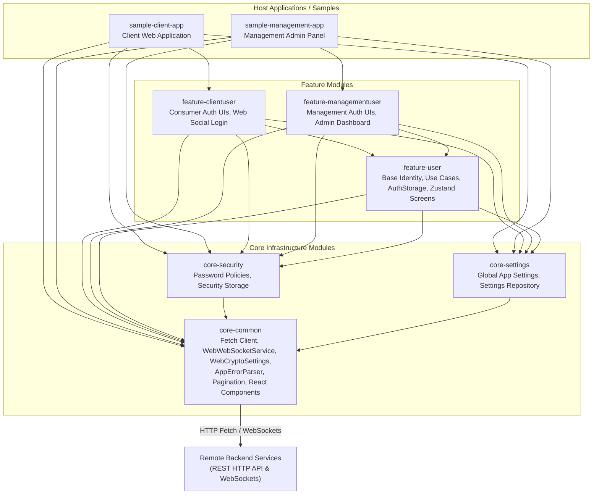
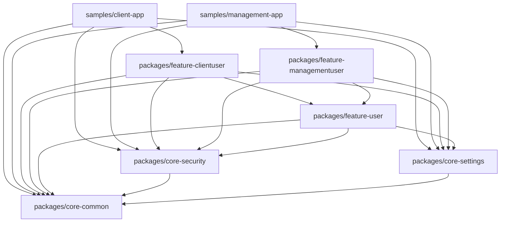

# Web Platform SDK Architecture

This document describes the high-level architecture, module dependency graph, and foundational design principles of the `web-platform-sdk` (TypeScript/React).

For detailed domain models, component relationships, and sequence diagrams of specific runtime processes, please refer to the specialized documentation in the `docs/architecture` directory:

- **[Identity & Access Domain Models](docs/architecture/identity_and_access.md)** — Core models: User Application Types (`AppType`), User Roles (`UserRole`), Account Statuses (`UserAccountStatus`), User Identifiers (`UserIdentifier`), Sessions (`UserSession`), and Step-up MFA Challenge handling.
- **[SDK Bootstrap & Component Initialization](docs/architecture/flows/sdk_bootstrap.md)** — Manual DI startup sequence, component wiring (`CommonComponent`, `ClientUserComponent`), network interceptor plugins, error parser registration, and initial synchronization.
- **[Authentication & Token Refresh](docs/architecture/flows/authentication.md)** — Multi-provider authentication (Email, Phone, Google Sign-In for Web), WebCrypto token persistence, and synchronized `401 Unauthorized` token refresh interceptors.
- **[Error Handling & Parsing Pipeline](docs/architecture/flows/error_handling.md)** — `AppResult` pattern, `AppError` taxonomy (`CommonError`, `SecurityError`, `UserError`), Chain of Responsibility parsing (`AppErrorParser`), and React string dictionary resolution.
- **[WebSocket Synchronization](docs/architecture/flows/websockets.md)** — `WebWebSocketService` lifecycle, connection management, ping/pong heartbeats, message handler routing (`WebSocketMessageHandler`), and reactive Zustand store updates.
- **[Security & Password Policy / TOTP / Unlock](docs/architecture/flows/security.md)** — Dynamic password policy validation (`PasswordPolicyValidator`), TOTP MFA lifecycle (setup, QR code, recovery codes), and account recovery (`UnlockRootContainer` for `SECURITY_HOLD`).
- **[Account & Profile Management Flows](docs/architecture/flows/account_management_flows.md)** — Active sessions listing & remote revocation, identifier linking & OTP code throttling, password changes, and account deletion scheduling & restoration.
- **[Encrypted Storage & Platform Infrastructure](docs/architecture/flows/storage_and_platform.md)** — `EncryptedSettings` abstraction (WebCrypto AES-GCM via browser `localStorage`), browser metadata (`DeviceInfoProvider`), external launchers, and pagination infrastructure (`PaginationState`).

---

## 1. High-Level Architecture

The platform is designed as a modular **TypeScript** client SDK targeting web browsers. It provides a unified foundation for `fetch`-based networking, AES-GCM encrypted storage, security policies, and identity management. By combining **React** UI components (styled with Tailwind CSS and tokens) with **Zustand** state machines for navigation flows, host applications can integrate complete authentication and management dashboards with minimal boilerplate.

---

## 2. Workspace Package Graph

The project is structured as a `pnpm` monorepo workspace. It enforces strict layer boundaries: `core-common` is the foundational leaf package and must never depend on any `feature-*` packages. Feature modules depend on core primitives and `core-common`. Host applications aggregate the entire graph at their composition root.

