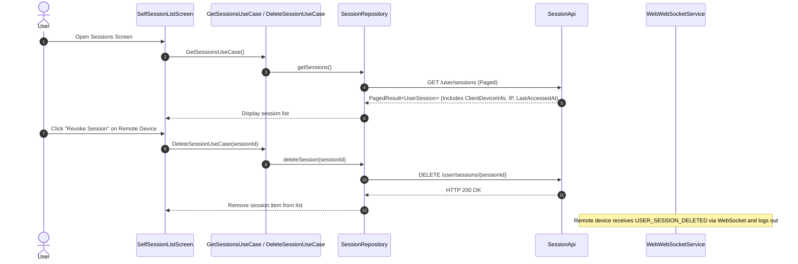
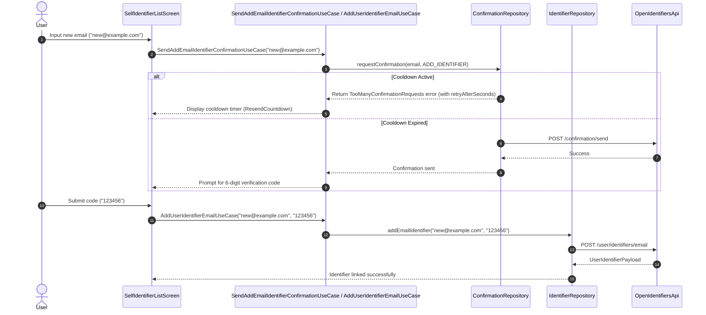
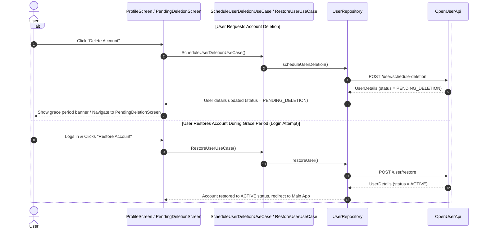

# Account & Profile Management Flows

This document describes profile updates, active session management, identifier (email/phone) linking, and account deletion and restoration workflows in `web-platform-sdk`.

---

## 1. Profile Management Architecture

Profile management is centralized in `ProfileRootContainer` (`feature-user`). The component uses React state/Zustand navigation machines to host:
- `MainProfileScreen`: Overview of profile details, account status, security settings, and navigation hub.
- `SelfSessionListScreen`: Active sessions list with remote revocation controls.
- `SelfIdentifierListScreen`: Identifiers list (emails, phone numbers, Google accounts) with add/remove capabilities.
- `TotpMainScreen`: TOTP 2FA setup and recovery code management.

---

## 2. Active Session Management & Revocation Flow

Users can inspect all devices/browsers where their account is currently authenticated:

---

## 3. User Identifiers Linking & Confirmation Throttling

Adding a new identifier (email address or phone number) requires OTP code confirmation. Cooldown throttling is managed by the `ConfirmationRepository`.

---

## 4. Account Deletion & Restoration Flow

