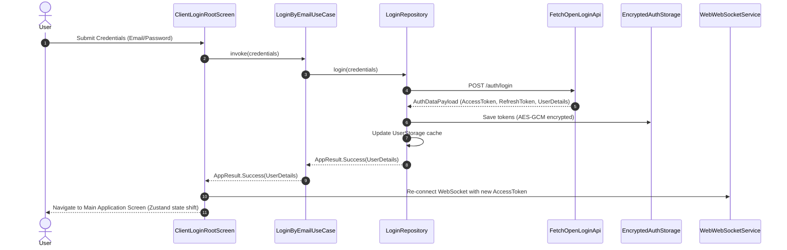
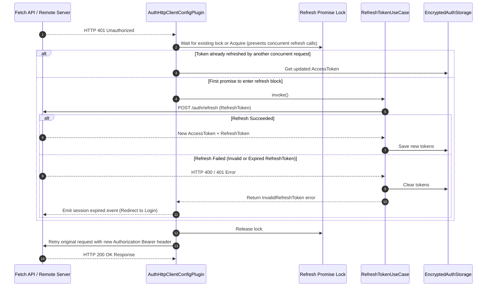

# Authentication & Token Refresh Flow

This document describes the multi-provider authentication flows, WebCrypto token storage, and the transparent access token refresh mechanism provided by `web-platform-sdk`.

---

## 1. Authentication Overview

The SDK supports flexible multi-provider authentication:
- **Email & Password**: Direct login (`LoginByEmailUseCase`) or registration with confirmation codes (`SendRegistrationConfirmationToEmailUseCase`, `RegistrationByEmailUseCase`).
- **Phone OTP**: Login or registration via SMS verification codes (`SendLoginConfirmationToPhoneUseCase`, `LoginByPhoneUseCase`).
- **Google Sign-In**: Authentication utilizing `WebGoogleAuthService` (leveraging the standard Google Identity Services web scripts).
- **TOTP / MFA**: Secondary authentication step when TOTP is enabled on the user account (`LoginByTotpUseCase`, `LoginByTotpRecoveryCodeUseCase`).

---

## 2. Authentication Sequence Diagram

---

## 3. Synchronized Token Refresh Flow (`AuthHttpClientConfigPlugin`)

When a standard HTTP `fetch` API request fails with `401 Unauthorized`, `AuthHttpClientConfigPlugin` catches the error and handles token renewal transparently without interrupting the React UI or throwing runtime exceptions. Concurrency is managed via a shared Promise lock (Mutex).

---

## 4. Web-Specific Social Auth Implementations

In the web environment, native components like Android's `CredentialManager` are unavailable.
- **Web (`WebGoogleAuthService`)**: Wraps the standard Google Identity Services script. Displays the One-Tap prompt or standard sign-in pop-up, retrieves the Google ID token (JWT), and forwards it to the backend `LoginByGoogleUseCase`.
- **Disabled Services**: iOS/Android implementations (`AndroidUserAuthServices`) from the KMP counterpart are omitted, and fallback `DisabledGoogleAuthService` is used if configuration is missing.
