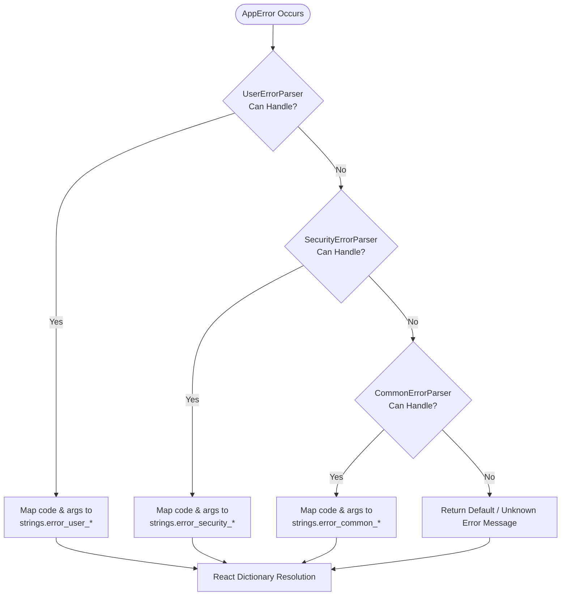

# Error Handling & Parsing Pipeline Flow

This document describes the unified error modeling, Chain of Responsibility parsing pipeline, and React string resolution architecture in `web-platform-sdk`.

---

## 1. Overview & Result Pattern

The SDK standardizes operation outputs using the `AppResult<T, E>` discriminated union (`Success` or `Failure`). This completely eliminates `throw new Error()` calls in the domain logic, ensuring type-safe error propagation.

Errors implement the `AppError` interface, providing:
- `id`: Unique `ErrorId` (UUID wrapper) generated per error instance for tracking across layers.
- `code`: Stable, machine-readable error code string (e.g., `CommonErrorCodes.INTERNAL`, `ClientUserErrorCodes.TOO_MANY_CONFIRMATION_REQUESTS`).
- `args`: Key-value map of dynamic metadata (e.g. `retryAfterSeconds`, `passwordMinLength`).
- `isRetryable`: Boolean indicating whether the operation can be safely retried by the user.

---

## 2. Error Taxonomy Hierarchy

```mermaid
classDiagram
    class AppError {
        <<interface>>
        +ErrorId id
        +String code
        +Record~String, String~ args
        +Boolean isRetryable
    }

    class CommonError {
        <<class>>
    }
    class SecurityError {
        <<class>>
    }
    class UserError {
        <<class>>
    }

    AppError <|-- CommonError
    AppError <|-- SecurityError
    AppError <|-- UserError

    class CommonErrorUnknown["CommonError (Code: UNKNOWN)"]
    class CommonErrorInternal["CommonError (Code: INTERNAL)"]
    class CommonErrorNetwork["CommonError (Code: NETWORK)"]
    class CommonErrorContractViolation["CommonError (Code: CONTRACT_VIOLATION)"]

    CommonError <|-- CommonErrorUnknown
    CommonError <|-- CommonErrorInternal
    CommonError <|-- CommonErrorNetwork
    CommonError <|-- CommonErrorContractViolation

    class SecurityPasswordPolicyUnavailable["SecurityError (Code: PASSWORD_POLICY_UNAVAILABLE)"]
    class SecurityPasswordTooShort["SecurityError (Code: PASSWORD_TOO_SHORT)"]

    SecurityError <|-- SecurityPasswordPolicyUnavailable
    SecurityError <|-- SecurityPasswordTooShort

    class UserInvalidRefreshToken["UserError (Code: INVALID_REFRESH_TOKEN)"]
    class UserExternalAuthCancelled["UserError (Code: EXTERNAL_AUTH_CANCELLED)"]
    class UserTooManyConfirmationRequests["UserError (Code: TOO_MANY_CONFIRMATION_REQUESTS)"]

    UserError <|-- UserInvalidRefreshToken
    UserError <|-- UserExternalAuthCancelled
    UserError <|-- UserTooManyConfirmationRequests
```



---

## 3. AppErrorParser Chain of Responsibility Pipeline

Errors are parsed into user-facing, localized strings using `AppErrorParserBuilder`. Specialized feature parsers take precedence, falling back to `CommonErrorParser`.



---

## 4. UI Error String Resolution in React

Within React UI components, error messages are resolved dynamically using the `useAppErrorParser()` hook provided by `SdkProvider`:

```tsx
import { useAppErrorParser, FullscreenError } from '@mudrichenkoevgeny/web-platform-sdk-core-common'

export const MyComponent = ({ error }) => {
  const parser = useAppErrorParser()

  // Resolves the exact localized message based on the error code
  const errorMessage = parser.parse(error) ?? 'An unknown error occurred.'

  return (
    <FullscreenError
      message={errorMessage}
      onRetry={error.isRetryable ? retryOperation : undefined}
    />
  )
}
```

---

## 5. Diagnostic Logging via AppErrorLogger

All `AppError` instances support detailed diagnostic logging using the SDK's internal logger:
- Logs the error class, `ErrorId`, `code`, dynamic `args`, and underlying system traces for internal or network failures to the browser console natively.
