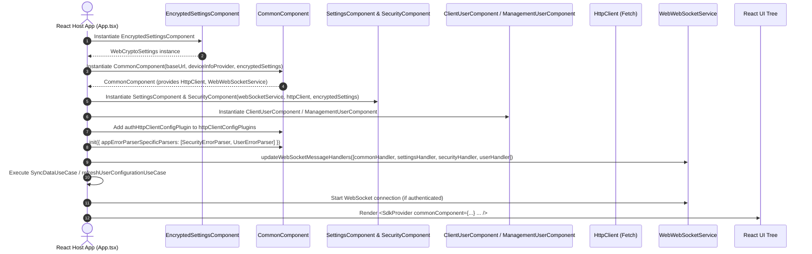

# SDK Bootstrap & Component Initialization Flow

This document details the startup sequence, manual dependency injection hierarchy, plugin registration, and initial state synchronization in the `web-platform-sdk`.

---

## 1. Overview

The Web SDK utilizes a modular, manual dependency injection (DI) approach. The host application (e.g. `sample-client-app` or `sample-management-app`) initializes core infrastructure first, attaches feature modules, installs network interceptors and error parsers, and performs initial data synchronization before rendering the main React UI tree using `SdkProvider`.

---

## 2. Initialization Flow Diagram

---

## 3. Step-by-Step Initialization Sequence

### Step 1: Storage Layer Assembly
The host app initializes `EncryptedSettingsComponent`. In the web environment, this automatically utilizes `WebCryptoSettings`, a secure AES-GCM abstraction wrapping the browser's native `localStorage` and `sessionStorage`.

### Step 2: Root Infrastructure Assembly (`CommonComponent`)
`CommonComponent` is instantiated as the single source of truth for base network execution (Fetch), platform metadata (`DeviceInfoProvider`), and the error parsing pipeline (`AppErrorParser`).

### Step 3: Domain Components Assembly
Feature components are constructed by passing `CommonComponent` dependencies down:
- `SettingsComponent`: Global application settings management.
- `SecurityComponent`: Backend password policies and validation.
- `ClientUserComponent` / `ManagementUserComponent`: Authentication, token persistence (`EncryptedAuthStorage`), identity, and user profile management.

### Step 4: System Wiring (`init()` Phase)
Before invoking any network operations or UI rendering:
1. **Network Interceptor Registration**: `authHttpClientConfigPlugin` from `ClientUserComponent` is pushed into `commonComponent.httpClientConfigPlugins`.
2. **Error Parser Chain Assembly**: `commonComponent.init()` is invoked with `SecurityErrorParser` and `UserErrorParser`.
3. **WebSocket Handler Routing**: Domain-specific `WebSocketMessageHandler` implementations are registered in `WebWebSocketService`.

### Step 5: Startup Data Synchronization
The application invokes initial synchronization use cases (e.g., `RefreshClientUserConfigurationUseCase` or host-specific `SyncDataUseCase`) to fetch global settings, security policies, and user session details in parallel, updating local encrypted caches.

### Step 6: UI Injection
The assembled components are injected into the React hierarchy using the `SdkProvider` React Context wrapper:
- Allows deep components to call `useSdkStore()`, `useCommonComponent()`, and `useAppErrorParser()`.
