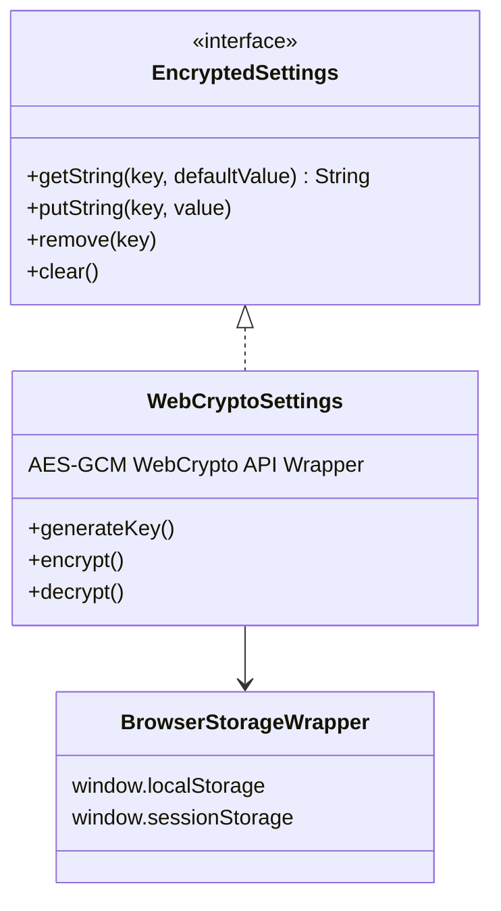
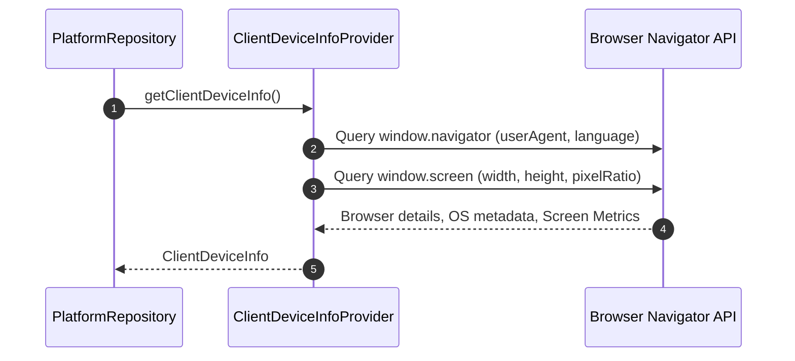

# Encrypted Storage & Platform Infrastructure Flow

This document details target-specific encrypted storage abstractions, browser platform metadata resolution, external system integration, and pagination infrastructure in `web-platform-sdk`.

---

## 1. Encrypted Storage Web Abstraction (`EncryptedSettings`)

The SDK mandates secure client persistence via `EncryptedSettings` (`core-common`), isolating domain logic from the physical storage API.

### Storage Backend
- **Web (`WebCryptoSettings`)**: Built on the native browser `window.crypto.subtle` API. It generates an AES-GCM symmetric key, encrypts all key-value entries into base64 ciphertexts, and persists them securely in `localStorage` or `sessionStorage`.

---

## 2. Platform Metadata Resolution (`ClientDeviceInfoProvider`)

`PlatformRepository` collects immutable browser hardware and environment metadata:

`ClientDeviceInfo` is automatically attached to HTTP headers and WebSocket initialization payloads to maintain accurate audit trails on the backend.

---

## 3. External System Interactions (`ExternalLauncher`)

Platform-native actions (opening external links, mail clients) are unified behind `ExternalLauncher`:
- **Web Implementation**: Utilizes `window.open(url, '_blank')` for URLs, and standard `window.location.href` for `mailto:` and `tel:` links.

---

## 4. Listing & Pagination Infrastructure

For infinite scrolling lists (sessions, identifiers, audit logs), the SDK provides standardized pagination building blocks in `core-common`:

- **State Container (`PaginationState`)**: Tracks cumulative list items, current page number, loading flags, error states, and intersection boundaries.
- **Scroll Monitoring (`useInfiniteScroll`)**: A React hook that registers an `IntersectionObserver` on an invisible marker element at the end of the list. Eliminates scroll event layout thrashing.
- **UI Footer (`PagingFooter`)**: Standard component added as the last item of lists to render `CoreButton` loading indicators or retry actions for failed pages.
