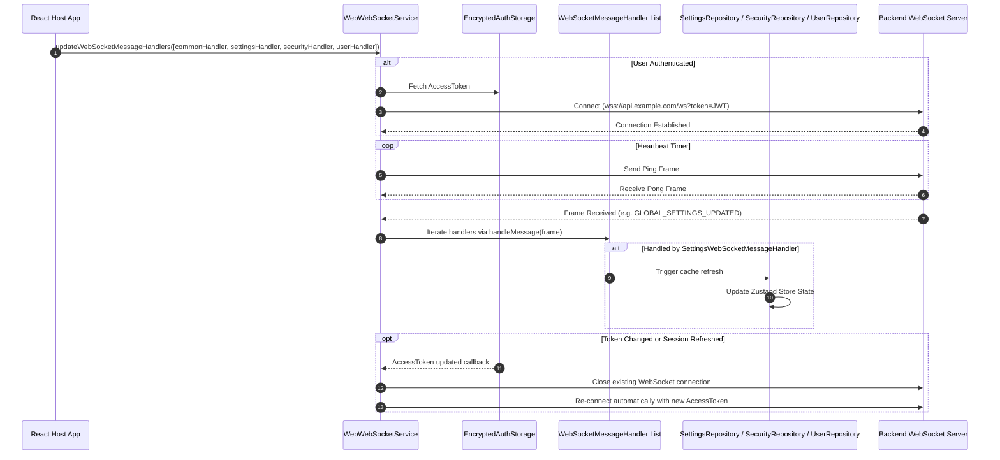

# WebSocket Lifecycle & Real-Time Synchronization Flow

This document describes connection management, ping/pong heartbeats, message handler routing, and reactive cache invalidation driven by WebSockets in `web-platform-sdk`.

---

## 1. Overview

Real-time synchronization across client modules is powered by `WebWebSocketService` (`core-common`). The service maintains an active WebSocket connection to the backend, appending the current `AccessToken` as a query parameter or connection header. When events occur on the server (e.g. global settings updated, user session revoked, profile edited), frames are received and dispatched to registered `WebSocketMessageHandler` instances.

---

## 2. WebSocket Connection Lifecycle & Message Routing

---

## 3. WebSocket Message Handlers Breakdown

| Handler | Domain Events | Action Taken |
| :--- | :--- | :--- |
| **`CommonWebSocketMessageHandler`** | Frame PING, PONG, INIT | Manages system heartbeats and framework-level connection acknowledgments. |
| **`SettingsWebSocketMessageHandler`** | `GLOBAL_SETTINGS_UPDATED` | Triggers background refresh of `OpenGlobalSettingsStorage` and updates the React/Zustand reactive state. |
| **`SecurityWebSocketMessageHandler`** | `SECURITY_SETTINGS_UPDATED` | Triggers background refresh of `OpenSecuritySettingsStorage` and re-evaluates `PasswordPolicyValidator`. |
| **`UserWebSocketMessageHandler`** | `USER_UPDATED`, `USER_SESSION_DELETED`, `USER_IDENTIFIER_UPDATED` | Updates `UserStorage` cache, invalidates the current session if deleted remotely, and pushes fresh `UserDetails` to the UI. |

---

## 4. Reactive State Propagation

Repositories combine encrypted local storage with WebSocket event listeners and Zustand state machines:
1. Initial state is served immediately from `WebCryptoSettings` (cache-first rendering).
2. When a WebSocket update frame arrives, the handler calls the respective repository.
3. The repository fetches the latest state from the API, updates the encrypted cache in memory and storage, and pushes the new state to the Zustand store.
4. React components listening to the store via hooks (e.g., `useGlobalSettings()`) re-render automatically.
